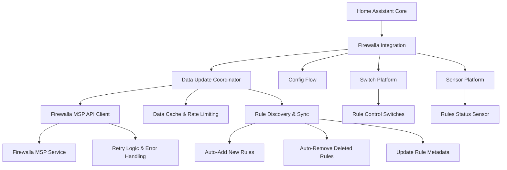

# Design Document

## Overview

The Firewalla Home Assistant integration is a HACS-compatible custom integration that provides firewall rule control for Firewalla devices through the MSP API. The integration follows Home Assistant's architectural patterns and HACS publication standards, implementing a coordinator-based approach for efficient API communication and automatic rule discovery.

The integration focuses on rule management: automatically discovering existing Firewalla rules and creating switch entities for each rule, allowing users to pause/unpause rules through Home Assistant. Each switch entity represents a single firewall rule, with ON state meaning the rule is active and OFF state meaning the rule is paused. The integration automatically handles rule additions, deletions, and modifications, ensuring the Home Assistant entities stay synchronized with the Firewalla configuration.

## Architecture

### High-Level Architecture



### HACS-Compatible Structure

The integration follows HACS requirements and Home Assistant standards:

```
custom_components/firewalla/
├── __init__.py          # Integration setup and lifecycle
├── config_flow.py       # Configuration flow with MSP authentication
├── const.py            # Constants and configuration
├── coordinator.py      # DataUpdateCoordinator + MSP API client
├── switch.py           # Block and gaming switch entities
├── sensor.py           # Device status and rules sensors
├── manifest.json       # HACS metadata and dependencies
├── strings.json        # Localization strings
└── translations/       # Additional language support
    └── en.json
```

### Component Architecture

The integration follows Home Assistant's recommended patterns:

1. **Integration Core** (`__init__.py`): Handles integration lifecycle, coordinator setup, and platform loading
2. **Configuration Flow** (`config_flow.py`): Manages MSP authentication and Firewalla box selection with proper validation
3. **Data Coordinator** (`coordinator.py`): Centralizes MSP API communication with built-in rule discovery and synchronization
4. **Switch Platform** (`switch.py`): Provides switch entities for each discovered firewall rule
5. **Sensor Platform** (`sensor.py`): Monitors overall rule status and integration health
6. **Constants** (`const.py`): Centralizes configuration, endpoints, and rule type mappings

## MSP API Integration Strategy

### Focused API Coverage
The integration provides targeted access to essential Firewalla MSP API endpoints for device control and monitoring:

- **Core Functionality**: Focus on device blocking, gaming pause, and status monitoring
- **Reliable Communication**: Implement robust error handling and retry logic
- **Efficient Updates**: Use coordinator pattern with appropriate caching and rate limiting
- **Standards Compliance**: Follow Home Assistant and HACS best practices

### Configuration Flow Design
1. **MSP URL Input**: User provides Firewalla MSP service URL (format: `mydomain.firewalla.net`)
2. **Token Authentication**: User provides personal access token with validation and clear error messages
3. **Data Persistence**: Preserve entered MSP URL and token on validation failures to avoid re-entry
4. **Box Selection**: Present available Firewalla boxes from MSP account with descriptive names (if multiple boxes)
5. **Connection Validation**: Verify API connectivity, permissions, and rule access before completion
6. **Rule Discovery**: Automatically discover existing rules and prepare for entity creation
7. **Error Handling**: Provide specific, actionable error messages with troubleshooting guidance for common setup failures

**Error Message Examples**:
- Invalid MSP URL format: "MSP URL should be in format 'mydomain.firewalla.net' (without https://)"
- Authentication failure: "Invalid access token. Please check your token in MSP settings."
- Network connectivity: "Cannot connect to MSP service. Please check your internet connection and MSP URL."
- No boxes found: "No Firewalla boxes found in your MSP account. Please ensure your box is properly registered."

**Design Rationale**: The configuration flow prioritizes user experience by validating each step before proceeding and preserving user input on failures. Clear, specific error messages help users troubleshoot common issues without frustration, addressing Requirement 1 (MSP API Authentication and Setup) by providing comprehensive validation and error messaging throughout the setup process.

### API Endpoint Integration
Based on Firewalla MSP API documentation and examples (github.com/firewalla/msp-api-examples):

**Base URL Format**: `https://{msp_domain}/v2` where `msp_domain` is user's MSP domain (e.g., `mydomain.firewalla.net`)

**Authentication**: 
- Header: `Authorization: Token {access_token}`
- Content-Type: `application/json`

**Core Endpoints**:
- **Rule Discovery**: `GET /rules` - Get all rules with optional query parameters
- **Rule Query**: `GET /rules?query={conditions}` - Filter rules by status, action, etc.
- **Rule Pause**: `POST /rules/{rule_id}/pause` - Pause a specific rule
- **Rule Unpause**: `POST /rules/{rule_id}/unpause` - Unpause a specific rule (endpoint to be confirmed)
- **Legacy Rule List**: `GET /v1/rule/list` - Legacy endpoint for rule listing (deprecated but functional)

**Query Parameters for Rule Discovery**:
- `status:active` - Get active (unpaused) rules
- `status:paused` - Get paused rules  
- `action:allow` - Get allow rules
- `action:block` - Get block rules
- Combined queries: `status:paused action:allow` - Get paused allow rules

**Rate Limiting and Caching**:
- Maximum 10 requests/minute per device with intelligent batching
- 30+ second response caching to minimize API load
- Exponential backoff for failed requests
- Change detection using rule modification timestamps

**Design Rationale**: The API integration follows the official MSP API examples exactly to ensure compatibility and reliability. The v2 API provides better query capabilities for efficient rule discovery and filtering, addressing Requirements 2 (Automatic Rule Discovery) and 3 (Rule Control) while maintaining efficient API usage per Requirement 10 (Performance and Scalability).

### HACS Publication Requirements
- **Repository Structure**: Follow HACS integration requirements with proper file organization
- **Manifest Compliance**: Include complete manifest.json with proper metadata and dependencies
- **Version Management**: Implement semantic versioning with GitHub releases
- **Documentation**: Provide comprehensive README with installation and usage instructions
- **Quality Standards**: Include proper error handling, logging, and code organization

## Components and Interfaces

### Core Integration Component

**File**: `__init__.py`
- **Purpose**: Integration entry point and lifecycle management
- **Responsibilities**:
  - Initialize the DataUpdateCoordinator with MSP API client
  - Set up dynamic entity platforms based on API discovery
  - Handle integration reload and unload
  - Manage integration-wide configuration

**Key Methods**:
- `async_setup_entry()`: Initialize coordinator and discover/create platforms
- `async_unload_entry()`: Clean up resources on removal
- `async_reload_entry()`: Handle configuration updates

### Configuration Flow

**File**: `config_flow.py`
- **Purpose**: Handle MSP API authentication and device selection
- **Responsibilities**:
  - Authenticate with Firewalla MSP API using URL and personal access token
  - Discover available API endpoints and capabilities
  - Retrieve list of available Firewalla devices from MSP account
  - Present device selection interface to user
  - Validate selected device connectivity and permissions

**Key Methods**:
- `async_step_user()`: Handle MSP URL and token input with comprehensive validation and data persistence
- `async_step_box_selection()`: Present available boxes for user selection (if multiple boxes exist)
- `_authenticate_msp()`: Validate MSP credentials using Token authentication against v2 API
- `_validate_msp_url()`: Validate MSP URL format (mydomain.firewalla.net)
- `_get_available_boxes()`: Fetch box list from MSP API with error handling
- `_test_rule_access()`: Verify rule access permissions using `/v2/rules` endpoint
- `_handle_setup_errors()`: Provide specific, actionable error messages for common failure scenarios
- `_preserve_user_input()`: Maintain user-entered data across validation failures

**Design Rationale**: The configuration flow emphasizes validation at each step to prevent incomplete setups and provides clear error messaging to guide users through troubleshooting, directly addressing Requirements 1.2, 1.5, and 7.4.

### Data Update Coordinator

**File**: `coordinator.py`
- **Purpose**: Centralized MSP API communication and data management following Home Assistant patterns
- **Responsibilities**:
  - Manage Firewalla MSP API client session with proper timeout and retry handling
  - Coordinate data updates with minimum 30-second intervals for API rate limiting
  - Handle MSP API authentication with automatic token refresh
  - Implement exponential backoff retry logic for failed requests
  - Provide comprehensive error handling and logging
  - Cache API responses to minimize unnecessary requests

**Key Methods**:
- `_async_update_data()`: Fetch latest rule data from MSP API with error handling
- `async_get_rules()`: Get all rules using `/v2/rules` endpoint with optional query filters
- `async_pause_rule(rule_id)`: Pause a rule using `POST /v2/rules/{rule_id}/pause`
- `async_unpause_rule(rule_id)`: Unpause a rule using `POST /v2/rules/{rule_id}/unpause`
- `async_get_rule_status(rule_id)`: Get individual rule status for verification
- `_detect_rule_changes()`: Compare current rules with cached rules to detect additions/deletions/modifications
- `_authenticate()`: Validate MSP credentials using Token authentication

**Data Structure**:
```python
{
    "box_info": {
        "gid": "box-guid-string",
        "name": "Firewalla Gold",
        "model": "gold",
        "online": True,
        "version": "1.975",
        "lastSeen": 1648632679193
    },
    "rules": {
        "rule-uuid-1": {
            "rid": "rule-uuid-1",
            "type": "internet",
            "target": "mac:aa:bb:cc:dd:ee:ff",
            "target_name": "John's Laptop",
            "disabled": False,
            "paused": False,
            "action": "block",
            "description": "Block internet during study time",
            "priority": 1000,
            "created_at": 1648632679193,
            "modified_at": 1648632679193,
            "schedule": {
                "enabled": True,
                "days": ["monday", "tuesday"],
                "start_time": "20:00",
                "end_time": "22:00"
            }
        },
        "rule-uuid-2": {
            "rid": "rule-uuid-2",
            "type": "category",
            "target": "category:gaming",
            "target_name": "Gaming Category",
            "disabled": False,
            "paused": True,
            "action": "block",
            "description": "Block gaming websites",
            "priority": 500,
            "created_at": 1648632679193,
            "modified_at": 1648632679193,
            "schedule": None
        }
    },
    "rule_count": {
        "total": 15,
        "active": 12,
        "paused": 3,
        "by_type": {
            "internet": 8,
            "category": 4,
            "domain": 3
        }
    }
}
```

### MSP API Client

**Integrated within**: `coordinator.py`
- **Purpose**: Handle comprehensive Firewalla MSP API communication
- **Responsibilities**:
  - Manage aiohttp ClientSession with all MSP API endpoints
  - Handle MSP personal access token authentication
  - Implement exponential backoff for failed requests
  - Map all MSP API responses to internal data structures
  - Provide generic interface for any API endpoint
  - Support dynamic API endpoint discovery

**Key Methods**:
- `_authenticate()`: Validate MSP credentials and get access token
- `_make_request()`: Generic MSP API request with retry logic and proper headers
- `_get()`: GET request wrapper with authentication
- `_post()`: POST request wrapper with authentication
- `_patch()`: PATCH request wrapper for rule updates
- `_handle_response()`: Process API responses and handle errors

### Entity Platforms

The integration creates entities through standard Home Assistant platform files, following HACS requirements and Home Assistant best practices for maintainability and predictability.

### Switch Entities

**File**: `switch.py`
- **Purpose**: Provide switch controls for each discovered Firewalla rule with proper state management
- **Entity Types**:
  - Rule control switches (one per rule): `firewalla_rule_{rule_id}`

**Key Methods**:
- `async_turn_on()`: Unpause the rule via MSP API with error handling
- `async_turn_off()`: Pause the rule via MSP API (preserves rule configuration)
- `is_on`: Return current state based on rule paused status from coordinator data (ON = active/unpaused, OFF = paused)
- `available`: Check coordinator data availability and API connectivity
- `device_info`: Provide proper device information for Home Assistant device registry

**Entity Features**:
- Unique IDs based on rule IDs for consistency across restarts (format: `firewalla_rule_{rule_id}`)
- Descriptive names using rule descriptions with fallback to rule type and target information
- Rich state attributes showing rule metadata (type, target, description, priority, schedule, etc.)
- Automatic entity creation for new rules and removal for deleted rules
- Proper handling of rule modifications and metadata updates

**Entity Attributes**:
- `rule_id`: Firewalla rule identifier
- `rule_type`: Type of rule (internet, category, domain, etc.)
- `target`: Rule target (MAC address, category, domain, etc.)
- `target_name`: Human-readable target name
- `action`: Rule action (block, allow, etc.)
- `priority`: Rule priority level
- `schedule`: Rule schedule information (if applicable)
- `created_at`: Rule creation timestamp
- `modified_at`: Rule last modification timestamp

**Design Rationale**: The entity design focuses on rule-centric control rather than device-centric, allowing users to manage any type of Firewalla rule through Home Assistant. This addresses Requirements 2 (Automatic Rule Discovery), 3 (Rule Control), 4 (Rule Metadata), and 5 (Entity Naming) by providing comprehensive rule management with rich metadata.

### Sensor Entities

**File**: `sensor.py`
- **Purpose**: Provide monitoring for overall rule status and integration health with proper attributes
- **Entity Types**:
  - Rules summary sensor: `firewalla_rules_summary`

**Key Methods**:
- `native_value`: Return total rule count from coordinator data
- `extra_state_attributes`: Provide detailed rule statistics and breakdown
- `available`: Check coordinator data freshness and API connectivity
- `device_info`: Link sensor to Firewalla device

**Sensor Features**:
- Shows total number of discovered rules as the main value
- Rich attributes including active/paused rule counts, rule type breakdown, and last update timestamp
- Integration health information including API connectivity status
- Proper state classes and device classes for Home Assistant UI

**Sensor Attributes**:
- `total_rules`: Total number of discovered rules
- `active_rules`: Number of active (unpaused) rules
- `paused_rules`: Number of paused rules
- `rules_by_type`: Breakdown of rules by type (internet, category, domain, etc.)
- `last_updated`: Last successful rule discovery timestamp
- `api_status`: Current API connectivity status

### Rule Discovery and Synchronization Strategy

Rules are discovered and managed automatically with intelligent synchronization:
- **Discovery**: Automatically discover all existing Firewalla rules on startup and during periodic updates
- **Entity Creation**: Create switch entities for each discovered rule with descriptive names and rich metadata
- **State Synchronization**: Continuously monitor rule changes and update entity states accordingly
- **Dynamic Management**: Automatically add entities for new rules and remove entities for deleted rules
- **Metadata Updates**: Update entity attributes when rule metadata changes (description, schedule, etc.)
- **Conflict Resolution**: Handle external rule modifications gracefully with state synchronization
- **Error Recovery**: Maintain entity availability even when individual rule operations fail

**Rule Filtering**:
- Include all controllable rules (rules that can be paused/unpaused)
- Exclude system rules that cannot be modified
- Handle rule types: internet blocking, category blocking, domain blocking, time-based rules, etc.

**Change Detection**:
- Compare rule lists between updates to detect additions and deletions
- Compare rule metadata to detect modifications
- Use rule modification timestamps for efficient change detection
- Implement debouncing to avoid excessive entity updates

**Design Rationale**: The rule discovery strategy provides comprehensive coverage of existing Firewalla rules while maintaining efficient synchronization. This addresses Requirements 2 (Automatic Rule Discovery), 3 (Rule Control), and 4 (Rule Metadata) by ensuring all controllable rules are available in Home Assistant with up-to-date information.

## Data Models

### Core Data Models
```python
@dataclass
class FirewallaBox:
    gid: str
    name: str
    model: str
    online: bool
    version: str
    last_seen: int

@dataclass
class FirewallaRule:
    rid: str
    type: str
    target: str
    target_name: str
    disabled: bool
    paused: bool
    action: str
    description: str
    priority: int
    created_at: int
    modified_at: int
    schedule: Optional[Dict[str, Any]]

@dataclass
class RuleStatistics:
    total: int
    active: int
    paused: int
    by_type: Dict[str, int]
```

### API Response Models
```python
@dataclass
class MSPResponse:
    success: bool
    data: Dict[str, Any]
    message: str = ""
    
@dataclass
class AuthResponse:
    token: str
    expires_in: int
    token_type: str = "Bearer"
```

## Error Handling and Reliability

### API Error Mapping
- **Connection Errors**: Map to `ConfigEntryNotReady` during setup with retry suggestions and troubleshooting guidance
- **Authentication Errors**: Map to `ConfigEntryAuthFailed` with clear credential guidance and token refresh instructions
- **Rate Limiting**: Implement exponential backoff (1s, 2s, 4s, 8s) with maximum 3 retry attempts and intelligent request spacing
- **Timeout Errors**: Use 30-second timeout with graceful degradation and user-friendly error messages
- **Server Errors**: Distinguish between temporary (5xx) and permanent (4xx) errors with appropriate retry strategies
- **Token Expiration**: Automatic token refresh with fallback to re-authentication flow

**Design Rationale**: The error handling strategy provides comprehensive coverage of failure scenarios while maintaining user experience through clear messaging and automatic recovery mechanisms, directly addressing Requirements 5.1, 5.2, 5.3, and 7.4.

### Entity Error States
- **Unavailable State**: Set when coordinator data is stale or API communication fails
- **Unknown State**: Set when device status cannot be determined from API data
- **Error Attributes**: Include last error timestamp and message in entity attributes
- **Recovery Logic**: Automatically recover when API communication is restored

### Logging Strategy
- **Debug Level**: API request/response details, state changes, entity updates
- **Info Level**: Integration lifecycle events, successful rule operations, device discoveries
- **Warning Level**: Recoverable errors, retry attempts, external rule conflicts
- **Error Level**: Unrecoverable errors, configuration issues, authentication failures

### HACS Quality Standards
- **Exception Handling**: Comprehensive try/catch blocks with specific exception types
- **Resource Cleanup**: Proper session management and resource disposal
- **State Consistency**: Ensure entity states remain consistent during error conditions
- **User Feedback**: Provide actionable error messages in the Home Assistant UI

## Testing Strategy

### Unit Testing
- **API Client**: Mock HTTP responses for all MSP API endpoints with realistic data
- **Coordinator**: Test data update logic, caching, retry logic, and error handling scenarios
- **Entities**: Verify state management, attribute handling, and device info consistency
- **Config Flow**: Test setup validation, authentication, device selection, and error scenarios

### Integration Testing
- **End-to-End Flows**: Test complete setup, entity creation, and rule management cycles
- **Error Scenarios**: Verify graceful handling of API failures, network issues, and authentication problems
- **State Consistency**: Ensure entity states accurately reflect actual device and rule status
- **Multi-Device Testing**: Verify proper handling of multiple devices and naming conflicts

### HACS Compliance Testing
- **Manifest Validation**: Verify manifest.json meets HACS requirements
- **Code Quality**: Ensure code follows Home Assistant and Python best practices
- **Documentation**: Validate README and documentation completeness
- **Repository Structure**: Confirm proper file organization and naming

### Test Data and Scenarios
- **Mock Devices**: Create representative device data covering various device types and states
- **API Responses**: Mock realistic Firewalla MSP API response formats based on official examples
- **Error Conditions**: Test authentication failures, network timeouts, rate limiting, and server errors
- **Edge Cases**: Handle empty device lists, missing hostnames, and malformed API responses

### Testing Tools and Framework
- **pytest**: Primary testing framework with Home Assistant test utilities
- **pytest-homeassistant-custom-component**: Home Assistant-specific testing helpers
- **aioresponses**: Mock aiohttp responses for comprehensive API testing
- **pytest-asyncio**: Support for async test functions and coordinator testing
- **pytest-cov**: Code coverage reporting to ensure comprehensive test coverage

## HACS Publication Requirements

### Repository Structure
```
firewalla-home-assistant/
├── custom_components/firewalla/    # Integration code
├── tests/                          # Comprehensive test suite
├── README.md                       # Installation and usage documentation
├── LICENSE                         # Open source license
├── .github/                        # GitHub workflows and templates
│   └── workflows/
│       └── validate.yml           # HACS validation workflow
├── hacs.json                       # HACS metadata (if needed)
└── info.md                         # HACS info page content
```

### Manifest Requirements
- **Domain**: Unique domain name matching repository
- **Name**: User-friendly integration name
- **Documentation**: Link to comprehensive documentation
- **Issue Tracker**: GitHub issues URL for bug reports
- **Code Owners**: GitHub usernames for maintenance
- **Dependencies**: Minimal external dependencies (aiohttp only)
- **IoT Class**: "cloud_polling" for MSP API integration
- **Integration Type**: "hub" for device management
- **Version**: Semantic versioning for releases

### Documentation Requirements
- **README.md**: Installation instructions, configuration guide, and usage examples
- **info.md**: HACS-specific information and features overview
- **Configuration Documentation**: Step-by-step MSP setup guide
- **Troubleshooting Guide**: Common issues and solutions
- **API Documentation**: Reference to Firewalla MSP API docs

### Quality Standards
- **Code Style**: Follow Home Assistant coding standards and Python PEP 8
- **Type Hints**: Comprehensive type annotations for better code quality
- **Error Handling**: Graceful error handling with user-friendly messages
- **Logging**: Appropriate logging levels with structured messages
- **Performance**: Efficient API usage with proper caching and rate limiting
- **Security**: Secure credential handling and API communication

### Release Management
- **Semantic Versioning**: Use semantic versioning (MAJOR.MINOR.PATCH)
- **GitHub Releases**: Create releases with changelog and assets
- **Version Tagging**: Proper Git tags for version tracking
- **Changelog**: Maintain CHANGELOG.md with version history
- **Breaking Changes**: Clear documentation of breaking changes

## Performance and Scalability

### Performance Optimization Strategy

The integration implements several performance optimizations to handle multiple devices efficiently:

- **Minimum Update Intervals**: 30-second minimum between API calls to respect rate limits and API constraints
- **Intelligent Caching**: Cache API responses with appropriate TTL to minimize unnecessary requests
- **Batch Operations**: Group related API requests to minimize network overhead and improve efficiency
- **Async Operations**: All API calls use async/await patterns for non-blocking execution
- **Resource Management**: Proper cleanup of aiohttp sessions and connections to prevent memory leaks
- **Startup Optimization**: Quick initialization without blocking Home Assistant startup process
- **Request Batching**: Efficiently handle multiple devices with batched API requests where possible

### Scalability Design

- **Multi-Device Support**: Handle multiple Firewalla devices without naming conflicts or performance degradation
- **Entity Limits**: No artificial limits on number of devices or entities created
- **Memory Efficiency**: Minimal memory footprint with efficient data structures and garbage collection
- **Network Efficiency**: Intelligent request scheduling and caching strategies to minimize API load

**Design Rationale**: Performance optimizations ensure the integration scales well with multiple devices while maintaining responsive user experience and respecting API limits, directly addressing all aspects of Requirement 8 (Performance and Scalability). The design prioritizes efficiency without sacrificing functionality or reliability.