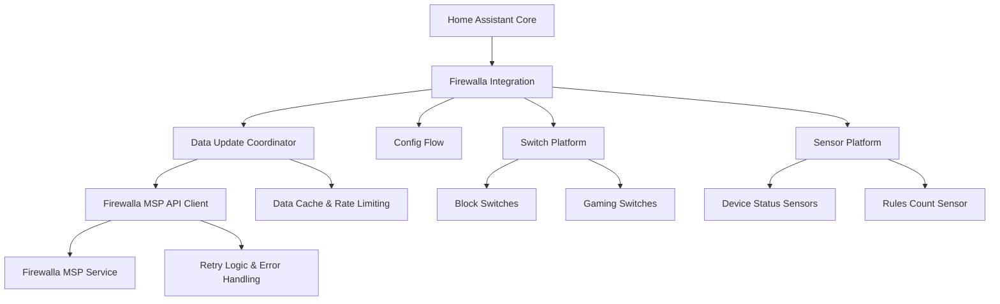

# Design Document

## Overview

The Firewalla Home Assistant integration is a HACS-compatible custom integration that provides device control and monitoring capabilities for Firewalla firewall devices through the MSP API. The integration follows Home Assistant's architectural patterns and HACS publication standards, implementing a coordinator-based approach for efficient API communication and reliable entity management.

The integration focuses on core functionality: device internet blocking, gaming pause controls, and status monitoring through well-defined Home Assistant entities. It prioritizes reliability, user experience, and seamless integration with Home Assistant's ecosystem while maintaining compatibility with HACS distribution requirements.

## Architecture

### High-Level Architecture



### HACS-Compatible Structure

The integration follows HACS requirements and Home Assistant standards:

```
custom_components/firewalla/
├── __init__.py          # Integration setup and lifecycle
├── config_flow.py       # Configuration flow with MSP authentication
├── const.py            # Constants and configuration
├── coordinator.py      # DataUpdateCoordinator + MSP API client
├── switch.py           # Block and gaming switch entities
├── sensor.py           # Device status and rules sensors
├── manifest.json       # HACS metadata and dependencies
├── strings.json        # Localization strings
└── translations/       # Additional language support
    └── en.json
```

### Component Architecture

The integration follows Home Assistant's recommended patterns:

1. **Integration Core** (`__init__.py`): Handles integration lifecycle, coordinator setup, and platform loading
2. **Configuration Flow** (`config_flow.py`): Manages MSP authentication and device selection with proper validation
3. **Data Coordinator** (`coordinator.py`): Centralizes MSP API communication with built-in MSP API client
4. **Switch Platform** (`switch.py`): Provides device blocking and gaming pause controls
5. **Sensor Platform** (`sensor.py`): Monitors device status and rule counts
6. **Constants** (`const.py`): Centralizes configuration, endpoints, and mappings

## MSP API Integration Strategy

### Focused API Coverage
The integration provides targeted access to essential Firewalla MSP API endpoints for device control and monitoring:

- **Core Functionality**: Focus on device blocking, gaming pause, and status monitoring
- **Reliable Communication**: Implement robust error handling and retry logic
- **Efficient Updates**: Use coordinator pattern with appropriate caching and rate limiting
- **Standards Compliance**: Follow Home Assistant and HACS best practices

### Configuration Flow Design
1. **MSP URL Input**: User provides Firewalla MSP service URL (default: https://firewalla.encipher.io)
2. **Token Authentication**: User provides personal access token with validation and clear error messages
3. **Box Selection**: Present available Firewalla boxes from MSP account with descriptive names
4. **Connection Validation**: Verify API connectivity, permissions, and device access
5. **Entity Creation**: Automatically create entities based on discovered devices and capabilities

### API Endpoint Integration
Based on Firewalla MSP API documentation and examples (github.com/firewalla/msp-api-examples):

- **Box Management**: Box listing and status via `/v2/msp/boxes` and `/v2/msp/boxes/{gid}`
- **Device Management**: Device listing and status via `/v2/msp/boxes/{gid}/devices`
- **Rule Management**: Rule CRUD operations via `/v2/msp/boxes/{gid}/rules`
- **Rule Control**: Pause/unpause operations via `/v2/msp/boxes/{gid}/rules/{rid}/pause`
- **Authentication**: Token-based authentication with automatic refresh handling

### HACS Publication Requirements
- **Repository Structure**: Follow HACS integration requirements with proper file organization
- **Manifest Compliance**: Include complete manifest.json with proper metadata and dependencies
- **Version Management**: Implement semantic versioning with GitHub releases
- **Documentation**: Provide comprehensive README with installation and usage instructions
- **Quality Standards**: Include proper error handling, logging, and code organization

## Components and Interfaces

### Core Integration Component

**File**: `__init__.py`
- **Purpose**: Integration entry point and lifecycle management
- **Responsibilities**:
  - Initialize the DataUpdateCoordinator with MSP API client
  - Set up dynamic entity platforms based on API discovery
  - Handle integration reload and unload
  - Manage integration-wide configuration

**Key Methods**:
- `async_setup_entry()`: Initialize coordinator and discover/create platforms
- `async_unload_entry()`: Clean up resources on removal
- `async_reload_entry()`: Handle configuration updates

### Configuration Flow

**File**: `config_flow.py`
- **Purpose**: Handle MSP API authentication and device selection
- **Responsibilities**:
  - Authenticate with Firewalla MSP API using URL and personal access token
  - Discover available API endpoints and capabilities
  - Retrieve list of available Firewalla devices from MSP account
  - Present device selection interface to user
  - Validate selected device connectivity and permissions

**Key Methods**:
- `async_step_user()`: Handle MSP URL and token input
- `async_step_device_selection()`: Present available devices for user selection
- `_authenticate_msp()`: Validate MSP credentials and discover API capabilities
- `_get_available_devices()`: Fetch device list from MSP API
- `_validate_device_access()`: Confirm access to selected device

### Data Update Coordinator

**File**: `coordinator.py`
- **Purpose**: Centralized MSP API communication and data management following Home Assistant patterns
- **Responsibilities**:
  - Manage Firewalla MSP API client session with proper timeout and retry handling
  - Coordinate data updates with minimum 30-second intervals for API rate limiting
  - Handle MSP API authentication with automatic token refresh
  - Implement exponential backoff retry logic for failed requests
  - Provide comprehensive error handling and logging
  - Cache API responses to minimize unnecessary requests

**Key Methods**:
- `_async_update_data()`: Fetch latest data from MSP API with error handling
- `async_get_box_info()`: Get Firewalla box information and online status
- `async_get_devices()`: Retrieve devices with status and metadata
- `async_get_rules()`: Get current rules filtered by integration-managed rules
- `async_create_rule()`: Create new blocking or gaming pause rules
- `async_pause_rule()`: Pause an existing rule (preserving for future use)
- `async_unpause_rule()`: Resume a paused rule
- `async_delete_rule()`: Delete rules when entities are removed

**Data Structure**:
```python
{
    "box_info": {
        "gid": "box-guid-string",
        "name": "Firewalla Gold",
        "model": "gold",
        "online": True,
        "version": "1.975",
        "lastSeen": 1648632679193
    },
    "devices": {
        "aa:bb:cc:dd:ee:ff": {
            "mac": "aa:bb:cc:dd:ee:ff",
            "name": "Device Name",
            "hostname": "device-hostname",
            "ip": "192.168.1.100",
            "online": True,
            "lastActiveTimestamp": 1648632679.193,
            "deviceClass": "laptop"
        }
    },
    "rules": {
        "rule-uuid": {
            "rid": "rule-uuid",
            "type": "internet",
            "target": "mac:aa:bb:cc:dd:ee:ff",
            "disabled": False,
            "paused": False,
            "action": "block",
            "description": "HA: Block internet access",
            "createdBy": "home-assistant"
        }
    }
}
```

### MSP API Client

**Integrated within**: `coordinator.py`
- **Purpose**: Handle comprehensive Firewalla MSP API communication
- **Responsibilities**:
  - Manage aiohttp ClientSession with all MSP API endpoints
  - Handle MSP personal access token authentication
  - Implement exponential backoff for failed requests
  - Map all MSP API responses to internal data structures
  - Provide generic interface for any API endpoint
  - Support dynamic API endpoint discovery

**Key Methods**:
- `_authenticate()`: Validate MSP credentials and get access token
- `_make_request()`: Generic MSP API request with retry logic and proper headers
- `_get()`: GET request wrapper with authentication
- `_post()`: POST request wrapper with authentication
- `_patch()`: PATCH request wrapper for rule updates
- `_handle_response()`: Process API responses and handle errors

### Entity Platforms

The integration creates entities through standard Home Assistant platform files, following HACS requirements and Home Assistant best practices for maintainability and predictability.

### Switch Entities

**File**: `switch.py`
- **Purpose**: Provide switch controls for device blocking and gaming pause with proper state management
- **Entity Types**:
  - Internet blocking switches (one per device): `firewalla_{mac}_block`
  - Gaming pause switches (gaming devices only): `firewalla_{mac}_gaming`

**Key Methods**:
- `async_turn_on()`: Create/activate rules via MSP API with error handling
- `async_turn_off()`: Pause rules (preserve for future use) rather than delete
- `is_on`: Return current state based on rule active status from coordinator data
- `available`: Check coordinator data availability and API connectivity
- `device_info`: Provide proper device information for Home Assistant device registry

**Entity Features**:
- Unique IDs based on MAC addresses for consistency across restarts
- Descriptive names using device hostnames when available
- Proper device grouping for multi-device households
- State attributes showing rule IDs and last updated timestamps

### Sensor Entities

**File**: `sensor.py`
- **Purpose**: Provide monitoring for device status and rule information with proper attributes
- **Entity Types**:
  - Device status sensors (one per device): `firewalla_{mac}_status`
  - Active rules count sensor: `firewalla_rules_active`

**Key Methods**:
- `native_value`: Return sensor value from coordinator data
- `extra_state_attributes`: Provide relevant device/rule information
- `available`: Check coordinator data freshness and API connectivity
- `device_info`: Link sensors to appropriate devices

**Sensor Features**:
- Device status sensors show online/offline with last seen timestamps
- Rules sensor shows count of active integration-managed rules
- Rich attributes including IP addresses, device classes, and rule details
- Proper state classes and device classes for Home Assistant UI

### Rules Management Strategy

Rules are managed transparently through switch entities:
- **Creation**: Switches create rules with descriptive names and "home-assistant" tags
- **State Management**: Rule pause/unpause preserves rules for future use
- **Cleanup**: Integration tracks and manages only its own rules
- **Conflict Resolution**: Handle external rule modifications gracefully

## Data Models

### Core Data Models
```python
@dataclass
class FirewallaBox:
    gid: str
    name: str
    model: str
    online: bool
    version: str
    last_seen: int

@dataclass
class FirewallaDevice:
    mac: str
    name: str
    ip: str
    online: bool
    last_active_timestamp: float
    device_class: str

@dataclass
class FirewallaRule:
    rid: str
    type: str
    target: str
    disabled: bool
    paused: bool
    action: str
    description: str
```

### API Response Models
```python
@dataclass
class MSPResponse:
    success: bool
    data: Dict[str, Any]
    message: str = ""
    
@dataclass
class AuthResponse:
    token: str
    expires_in: int
    token_type: str = "Bearer"
```

## Error Handling and Reliability

### API Error Mapping
- **Connection Errors**: Map to `ConfigEntryNotReady` during setup with retry suggestions
- **Authentication Errors**: Map to `ConfigEntryAuthFailed` with clear credential guidance
- **Rate Limiting**: Implement exponential backoff (1s, 2s, 4s, 8s) with maximum 3 retry attempts
- **Timeout Errors**: Use 30-second timeout with graceful degradation and user-friendly messages
- **Server Errors**: Distinguish between temporary (5xx) and permanent (4xx) errors

### Entity Error States
- **Unavailable State**: Set when coordinator data is stale or API communication fails
- **Unknown State**: Set when device status cannot be determined from API data
- **Error Attributes**: Include last error timestamp and message in entity attributes
- **Recovery Logic**: Automatically recover when API communication is restored

### Logging Strategy
- **Debug Level**: API request/response details, state changes, entity updates
- **Info Level**: Integration lifecycle events, successful rule operations, device discoveries
- **Warning Level**: Recoverable errors, retry attempts, external rule conflicts
- **Error Level**: Unrecoverable errors, configuration issues, authentication failures

### HACS Quality Standards
- **Exception Handling**: Comprehensive try/catch blocks with specific exception types
- **Resource Cleanup**: Proper session management and resource disposal
- **State Consistency**: Ensure entity states remain consistent during error conditions
- **User Feedback**: Provide actionable error messages in the Home Assistant UI

## Testing Strategy

### Unit Testing
- **API Client**: Mock HTTP responses for all MSP API endpoints with realistic data
- **Coordinator**: Test data update logic, caching, retry logic, and error handling scenarios
- **Entities**: Verify state management, attribute handling, and device info consistency
- **Config Flow**: Test setup validation, authentication, device selection, and error scenarios

### Integration Testing
- **End-to-End Flows**: Test complete setup, entity creation, and rule management cycles
- **Error Scenarios**: Verify graceful handling of API failures, network issues, and authentication problems
- **State Consistency**: Ensure entity states accurately reflect actual device and rule status
- **Multi-Device Testing**: Verify proper handling of multiple devices and naming conflicts

### HACS Compliance Testing
- **Manifest Validation**: Verify manifest.json meets HACS requirements
- **Code Quality**: Ensure code follows Home Assistant and Python best practices
- **Documentation**: Validate README and documentation completeness
- **Repository Structure**: Confirm proper file organization and naming

### Test Data and Scenarios
- **Mock Devices**: Create representative device data covering various device types and states
- **API Responses**: Mock realistic Firewalla MSP API response formats based on official examples
- **Error Conditions**: Test authentication failures, network timeouts, rate limiting, and server errors
- **Edge Cases**: Handle empty device lists, missing hostnames, and malformed API responses

### Testing Tools and Framework
- **pytest**: Primary testing framework with Home Assistant test utilities
- **pytest-homeassistant-custom-component**: Home Assistant-specific testing helpers
- **aioresponses**: Mock aiohttp responses for comprehensive API testing
- **pytest-asyncio**: Support for async test functions and coordinator testing
- **pytest-cov**: Code coverage reporting to ensure comprehensive test coverage

## HACS Publication Requirements

### Repository Structure
```
firewalla-home-assistant/
├── custom_components/firewalla/    # Integration code
├── tests/                          # Comprehensive test suite
├── README.md                       # Installation and usage documentation
├── LICENSE                         # Open source license
├── .github/                        # GitHub workflows and templates
│   └── workflows/
│       └── validate.yml           # HACS validation workflow
├── hacs.json                       # HACS metadata (if needed)
└── info.md                         # HACS info page content
```

### Manifest Requirements
- **Domain**: Unique domain name matching repository
- **Name**: User-friendly integration name
- **Documentation**: Link to comprehensive documentation
- **Issue Tracker**: GitHub issues URL for bug reports
- **Code Owners**: GitHub usernames for maintenance
- **Dependencies**: Minimal external dependencies (aiohttp only)
- **IoT Class**: "cloud_polling" for MSP API integration
- **Integration Type**: "hub" for device management
- **Version**: Semantic versioning for releases

### Documentation Requirements
- **README.md**: Installation instructions, configuration guide, and usage examples
- **info.md**: HACS-specific information and features overview
- **Configuration Documentation**: Step-by-step MSP setup guide
- **Troubleshooting Guide**: Common issues and solutions
- **API Documentation**: Reference to Firewalla MSP API docs

### Quality Standards
- **Code Style**: Follow Home Assistant coding standards and Python PEP 8
- **Type Hints**: Comprehensive type annotations for better code quality
- **Error Handling**: Graceful error handling with user-friendly messages
- **Logging**: Appropriate logging levels with structured messages
- **Performance**: Efficient API usage with proper caching and rate limiting
- **Security**: Secure credential handling and API communication

### Release Management
- **Semantic Versioning**: Use semantic versioning (MAJOR.MINOR.PATCH)
- **GitHub Releases**: Create releases with changelog and assets
- **Version Tagging**: Proper Git tags for version tracking
- **Changelog**: Maintain CHANGELOG.md with version history
- **Breaking Changes**: Clear documentation of breaking changes