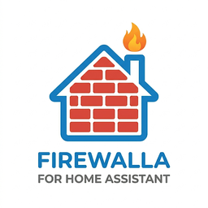
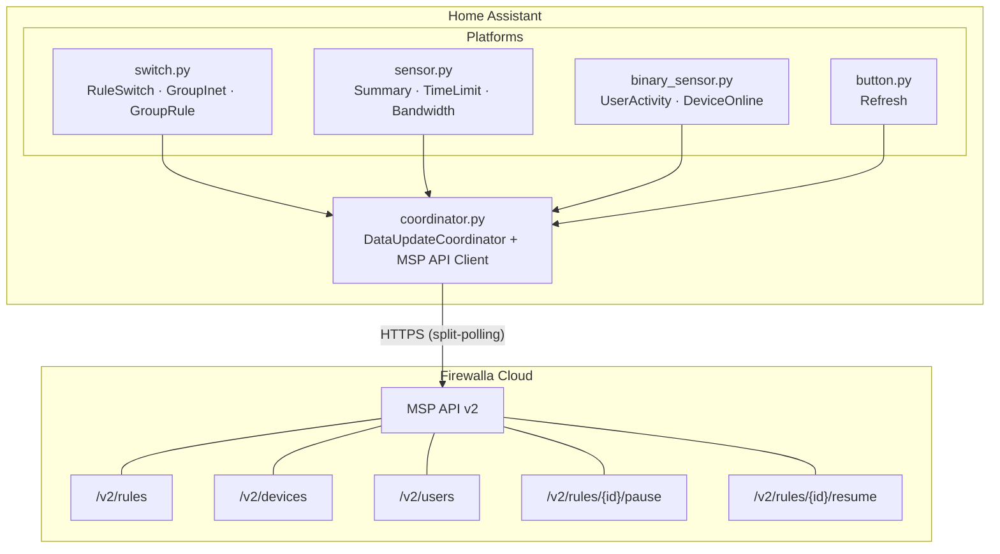

<p align="center">
  
</p>

<h1 align="center">Firewalla Home Assistant Integration</h1>

<p align="center">
  <a href="https://github.com/custom-components/hacs"></a>
  <a href="https://github.com/djuntgen/firewalla-home-assistant/releases"></a>
  <a href="LICENSE"></a>
</p>

A Home Assistant custom integration for managing Firewalla firewall rules, parental controls, and device monitoring via the MSP (Managed Service Provider) API v2.

## Why This Exists

Firewalla is great at managing your network, but checking time limits and toggling rules means opening the Firewalla app. This integration brings it all into Home Assistant so that:

- **Kids can see their own usage** — log into HA to check remaining screen time and internet limits, no parental app access needed
- **Parents can manage controls from any device** — toggle internet, app blocks, and time limits from the HA dashboard without opening the Firewalla app
- **It works with Apple HomeKit** — HA's HomeKit bridge exposes Firewalla switches to the Home app on every iPhone. No extra apps to install, no explanations needed. If your spouse has to ask how it works, it doesn't work.

## Features

- **Rule switches** — each Firewalla rule becomes an HA switch (toggle pause/resume)
- **Group internet switches** — "Block On" / "Block Off" matching the Firewalla app UX
- **Per-group rule switches** — category/app block rules per group
- **Time limit sensors** — per-user app and internet time limits with remaining minutes, quota, usage percentage
- **Per-user bandwidth sensors** — 24h download/upload in GB per user group
- **Per-device online sensors** — online/offline status with IP, MAC vendor, network, last seen
- **User activity sensors** — binary sensors detecting active internet usage per user
- **Rules summary sensor** — overview of total/active/paused rules with breakdown by type
- **Manual refresh button** — on-demand full data refresh from the Firewalla device page
- **Auto-generated dashboard** — enter user names, get a per-user parental control dashboard with progress bars, bandwidth graphs, device lists, and block toggles
- **Dynamic entity lifecycle** — entities auto-add/remove when Firewalla rules, groups, or devices change
- **Optimistic state updates** — UI reflects toggles immediately, confirmed on next poll
- **Split-polling** — time-sensitive data polled frequently; bulk data less often
- **Configurable polling intervals** — tune API call frequency via integration options
- **Dynamic naming** — all entity names derived from API data, no hardcoded strings
- **Reconfigure flow** — update MSP credentials without deleting the integration
- **HomeKit compatible** — all switches are exposed via HA's HomeKit bridge, controllable from the Home app on any iPhone/iPad

## Prerequisites

- Firewalla device (Gold, Gold SE, Purple, Purple SE, Blue, Red)
- Firewalla MSP account with API access enabled
- Personal Access Token from MSP settings
- Home Assistant 2026.4+

## Installation

### HACS (Recommended)

1. Open HACS in Home Assistant
2. Go to **Integrations** > three-dot menu > **Custom repositories**
3. Add this repository URL: `https://github.com/djuntgen/firewalla-home-assistant`
4. Select **Integration** as the category and click **Add**
5. Find "Firewalla" in the integration list and install it
6. Restart Home Assistant

### Manual

1. Copy the `custom_components/firewalla/` directory to your Home Assistant `config/custom_components/` directory
2. Restart Home Assistant

## Configuration

### Initial Setup

1. Go to **Settings > Devices & Services > Add Integration**
2. Search for "Firewalla"
3. Enter your MSP domain (e.g., `mydomain.firewalla.net`)
4. Enter your Personal Access Token
5. Select your Firewalla box (auto-selected if you only have one)

### Updating Credentials

Go to **Settings > Integrations > Firewalla > 3-dot menu > Reconfigure** to update your MSP domain or access token without deleting the integration.

### Polling Intervals (Settings > Integrations > Firewalla > Configure)

The integration polls the Firewalla API at configurable intervals. Lower values give faster updates but consume more of your API rate limit budget.

| Option | Default | Range | What it controls |
|--------|---------|-------|------------------|
| Base Poll Interval | 45s | 30-300s | How often the integration calls the Firewalla API. Each poll fetches **time limit data** (~5 KB) — minutes remaining, usage percentage. All other data types refresh at their own intervals below. A manual **Refresh** button is also available on the Firewalla device page. |
| Full Rules Refresh | 300s | 60-900s | How often to fetch **all firewall rules** — block/allow status, hit counts, schedules (~55 KB). Between full refreshes, only lightweight time limit data is fetched. |
| Devices Refresh | 600s | 60-600s | How often to fetch **device data** — online/offline status, IP addresses, bandwidth usage, activity detection (~45 KB). Higher values reduce API calls but delay device status updates. |
| Users Cache Duration | 1800s | 60-3600s | How long to cache **user and group names** (~2 KB). Names rarely change, so this can be set high. |

**API calls per minute at defaults:** ~1.7 (well within Firewalla's rate limits).

### Rule Filters (Settings > Integrations > Firewalla > Configure)

| Option | Description |
|--------|-------------|
| Include Filters | Only show rules matching these filters (one per line, OR logic). **Each filter adds an extra API call per full rules refresh.** |
| Exclude Filters | Hide rules matching these filters (one per line). **Each filter adds an extra API call per full rules refresh.** |

Filters use Firewalla's query syntax:

```
status:active           # Only active rules
action:block            # Only block rules
target.type:app         # Only app rules
target.type:category    # Only category rules
target.type:internet    # Only internet rules
scope.type:group        # Only group-scoped rules
```

## Entities

All entity names are derived from API data. Users can override display names via **Settings > Entities > friendly_name**.

### Switches

| Entity | Name Source | Description |
|--------|------------|-------------|
| Per-rule switch | Rule description/target | ON = rule active, OFF = rule paused |
| Group internet switch | "Internet" | ON = Block On (internet blocked), OFF = Block Off (internet allowed) — matches Firewalla app |
| Group rule switch | `{action} {target.value}` | ON = block active, OFF = block paused |

### Sensors

| Entity | Name Source | State | Key Attributes |
|--------|------------|-------|----------------|
| Rules summary | Static | Total rule count | active, paused, by_type |
| Time limit | `{target.value}` (e.g., "Internet", "Youtube") | Minutes remaining | quota_minutes, used_minutes, usage_percent, reached |
| Bandwidth (download) | "Download" | GB (24h) | bytes, mb |
| Bandwidth (upload) | "Upload" | GB (24h) | bytes, mb |

### Binary Sensors

| Entity | Name Source | State | Key Attributes |
|--------|------------|-------|----------------|
| User activity | "Active" | ON = traffic flowing | online_devices, active_devices, download_delta_bytes |
| Device online | Device name from API | ON = online | ip, mac_vendor, network, last_seen, download_24h_mb, upload_24h_mb |

### Buttons

| Entity | Description |
|--------|-------------|
| Refresh | Triggers an immediate full data refresh from the Firewalla API. Clears cached data so the next poll fetches everything fresh. |

### Device Grouping

Each Firewalla user group becomes an HA **device** named after the user (e.g., "Matt", "Harvey"). All entities for that user are grouped under their device. The main Firewalla box is also a device, hosting the rules summary sensor and refresh button.

## Architecture



### Split-Polling Strategy

The integration uses split-polling to minimize API calls while keeping time-sensitive data fresh:

| Data | Refresh Rate | Payload | What it provides |
|------|-------------|---------|------------------|
| App time limits | Every base poll (default 45s) | ~5.5 KB | Minutes remaining, usage percentage for `action:timelimit` rules |
| Internet time limits | Full rules refresh (default 5 min) | included in full rules | Block rules with `timeUsage` data — updated with all rules |
| All rules | Configurable (default 5 min) | ~55 KB | Block/allow status, hit counts, schedules — changes rarely |
| Devices | Configurable (default 10 min) | ~45 KB | Online/offline, IPs, bandwidth, activity detection |
| Users | Configurable (default 30 min) | ~2 KB | User/group names — almost never changes |

### Time Limit Detection

Firewalla represents time limits in two ways:
- `action: timelimit` + `scope: user` — app-specific limits (e.g., YouTube 60 min/day)
- `action: block` + `target: internet` + `scope: group` with `timeUsage` — Internet time limits (e.g., 2 hr/day)

Both are detected and surfaced as time limit sensors with `usage_percent` (capped at 100%).

## Usage

### Parental Control Dashboard

The integration auto-generates a per-user parental control dashboard. Each user gets their own column with activity, internet, bandwidth, time limits, devices, and blocks — all auto-discovered.

#### Prerequisites

Install from HACS:
1. **auto-entities** (required) — auto-discovers entities by pattern
2. **entity-progress-card** (required) — color-coded progress bars for time limits

Then create an empty dashboard in HA:
- Go to **Settings > Dashboards > Add Dashboard**
- Name it `dashboard-firewalla`, choose "New dashboard from scratch"

#### Setup

1. Go to **Settings > Integrations > Firewalla > Configure**
2. In the **Dashboard Users** field, enter your Firewalla user names, comma-separated:
   ```
   Matt, Harvey, Elaine
   ```
   Names must match your Firewalla group names exactly (case-sensitive).
3. Click **Submit** — the integration generates the dashboard automatically

The dashboard is regenerated each time the integration reloads (e.g., after changing options or restarting HA). To add or remove users, just update the comma-separated list and save.

#### What's Generated

Each user column includes:

| Section | What it shows |
|---------|--------------|
| **Activity** | Tile card — online/offline with green accent |
| **Internet** | Tile card — internet block toggle with red accent (Block On / Block Off) |
| **Bandwidth** | History graph — 8h download and upload trend |
| **Time Limits** | Progress bars — green (0-50%), yellow (50-80%), red (80-100%) using `usage_percent` |
| **Devices** | Entity list — per-device online/offline with last-changed |
| **Blocks** | Entity list — all block rule switches (apps, categories, content) |

All entities within each section are auto-discovered using `auto-entities` glob patterns. New rules, time limits, and devices appear automatically without editing the dashboard.

#### Notes

- The dashboard URL path must be `dashboard-firewalla` — create this dashboard in HA before configuring users
- If the dashboard doesn't exist yet, the integration logs a warning and skips generation
- Leave the **Dashboard Users** field empty to skip dashboard generation entirely
- You can still edit the generated dashboard manually in the HA UI after it's created

### HomeKit Integration

All Firewalla switches are automatically exposed to Apple HomeKit via HA's [HomeKit Bridge](https://www.home-assistant.io/integrations/homekit/). This means:

- **Internet block toggles** appear in the Home app on every iPhone and iPad
- **App and category block switches** can be toggled from Control Center
- **No extra apps** to install — it just works with the built-in Home app
- **Siri** can toggle rules: "Hey Siri, turn on Matt Internet"

To set this up, configure the HA HomeKit bridge integration and include the Firewalla switch entities you want exposed.

### Automation Examples

#### Block Gaming During School Hours
```yaml
automation:
  - alias: "Block Gaming During School Hours"
    trigger:
      - platform: time
        at: "08:00:00"
    condition:
      - condition: time
        weekday: [mon, tue, wed, thu, fri]
    action:
      - service: switch.turn_on
        target:
          entity_id: switch.firewalla_rule_gaming_category
```

#### Notify When Time Limit Almost Reached
```yaml
automation:
  - alias: "Warn When Time Limit Almost Reached"
    trigger:
      - platform: numeric_state
        entity_id: sensor.matt_internet_time
        attribute: usage_percent
        above: 80
    action:
      - service: notify.mobile_app
        data:
          message: "Internet time is at {{ state_attr('sensor.matt_internet_time', 'usage_percent') }}% — {{ state_attr('sensor.matt_internet_time', 'remaining_minutes') }} minutes left"
```

#### Auto-Block Internet at Bedtime
```yaml
automation:
  - alias: "Bedtime Internet Block"
    trigger:
      - platform: time
        at: "21:00:00"
    action:
      - service: switch.turn_on
        target:
          entity_id:
            - switch.firewalla_group_matt_matt_internet_access
            - switch.firewalla_group_harvey_harvey_internet_access
```

## FAQ

### What is the MSP API?

The MSP (Managed Service Provider) API is Firewalla's cloud API for managing devices and rules. It's separate from the local API on the box. You need an MSP account and a Personal Access Token to use it.

### What are the API rate limits?

Firewalla enforces two rate limits:
- **Short-term:** 100 requests per 5 minutes per token
- **Long-term:** 3,000 requests per day per token

At default settings, this integration uses ~1.7 calls/min (~2,448/day), which is 82% of the daily budget. This leaves room for manual refreshes, filter queries, and rule toggles.

### How do I avoid hitting rate limits?

- Increase the **Base Poll Interval** and **Devices Refresh** in integration options
- Remove include/exclude filters you don't need — each filter adds an API call per full rules refresh
- Use the **Refresh** button for on-demand updates instead of lowering poll intervals
- If you see HTTP 429 errors, the integration retries automatically with exponential backoff (1s, 2s, 4s)

### How do I update my API token?

Go to **Settings > Integrations > Firewalla > 3-dot menu > Reconfigure**. Enter your new token and save. The integration reloads automatically. Personal Access Tokens are long-lived until revoked.

### Can my kids see their own time limits?

Yes. Create an HA user account for each child and set up the parental control dashboard. They can log in and see their remaining time, usage percentage, and which apps are blocked — but they can't toggle switches unless you grant them permission. HA user permissions control what they can change.

### Can I control Firewalla from my iPhone without an app?

Yes. Set up the [HomeKit Bridge](https://www.home-assistant.io/integrations/homekit/) in HA and include the Firewalla switch entities. They'll appear in the built-in Home app on every iPhone and iPad — no extra apps to install. Your spouse can toggle internet blocks from Control Center without knowing what Firewalla is.

### Why don't I see time limit sensors?

Time limit sensors only appear for:
- Active (non-paused) time limits
- Rules with `quota > 0`
- App time limits (`action: timelimit` + `scope: user`) or Internet time limits (`action: block` + `scope: group` with `timeUsage` data)

### Why are my device sensors slow to update?

Device data (online/offline, bandwidth) refreshes at the **Devices Refresh** interval (default 10 min). This is intentional to reduce API calls — device data is ~45 KB per fetch. Lower this interval if you need faster updates, but watch your daily API budget.

### How do I rename entities?

All entity names come from the Firewalla API. To customize display names, go to **Settings > Entities**, find the entity, and set a **friendly_name**. This doesn't affect the entity ID.

### Can I create new Firewalla rules from Home Assistant?

No. This integration manages existing rules only (pause/resume). Rule creation must be done in the Firewalla app.

### How do I trigger a manual refresh?

Press the **Refresh** button on the Firewalla device page, or call the `button.press` service on `button.firewalla_refresh`. This clears all cached data and triggers an immediate full fetch.

### What happens if I have multiple Firewalla boxes?

Each box is set up as a separate integration instance. During setup, you'll be prompted to select which box to manage. Each box has its own coordinator, entities, and polling intervals.

### What HACS cards does the dashboard need?

The auto-generated dashboard requires two custom cards from HACS:
- **auto-entities** — dynamically discovers entities matching glob patterns
- **entity-progress-card** — renders time limit usage as color-coded progress bars (green/yellow/red)

Both are free and available in the default HACS repository.

## Troubleshooting

### "Failed to pause/resume rule" errors

- Check that your Personal Access Token has write permissions
- Verify the Firewalla box is online and reachable

### Authentication failed

- Go to **Settings > Integrations > Firewalla > 3-dot menu > Reconfigure**
- Generate a new Personal Access Token from your Firewalla MSP portal
- PATs are long-lived until revoked — if auth fails, the token may have been revoked or regenerated

### Entities not appearing

- Check **Settings > Devices & Services > Firewalla** for error messages
- Enable debug logging: add `custom_components.firewalla: debug` to `configuration.yaml`

### Rate limiting (HTTP 429)

- Increase polling intervals in the integration options
- The integration retries with exponential backoff (1s, 2s, 4s)

### Dashboard shows "Configuration error"

- Make sure **auto-entities** and **entity-progress-card** are installed from HACS
- Verify the dashboard exists at URL path `dashboard-firewalla`
- Check that user names in the **Dashboard Users** field exactly match your Firewalla group names

### Debug Logging

```yaml
logger:
  default: warning
  logs:
    custom_components.firewalla: debug
```

## Development

```bash
# Install test dependencies
pip install -r tests/requirements.txt

# Run all tests
pytest tests/ -v --tb=short

# Run a single test file
pytest tests/test_coordinator.py -v

# Run tests matching a pattern
pytest tests/ -k "test_split_polling" -v
```

## API Reference

- [Firewalla MSP API Docs](https://docs.firewalla.net)
- [MSP API Examples](https://github.com/firewalla/msp-api-examples)

## Changelog

See [CHANGELOG.md](docs/CHANGELOG.md) for version history.

## License

This project is licensed under the MIT License - see the [LICENSE](LICENSE) file for details.
